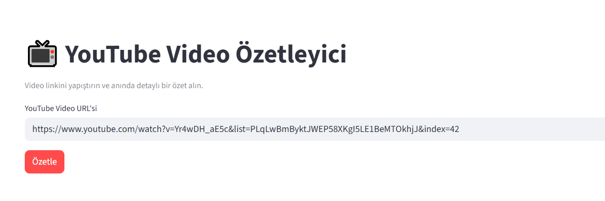
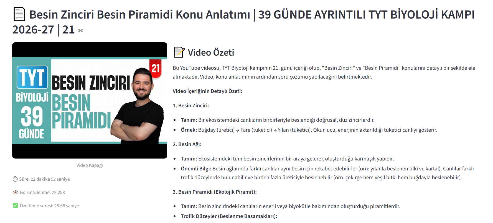

# 📺 YouTube Video Özetleyici

YouTube videolarının başlık, açıklama ve altyazı içeriklerini analiz ederek **Google Gemini** modeli ile detaylı ve anlaşılır özetler oluşturan bir web aracıdır.

---
## 🚀 Özellikler
- ✅ YouTube video linki ile otomatik özet alma
- ✅ Türkçe ve İngilizce altyazı desteği
- ✅ Otomatik altyazı çözümleme
- ✅ Başlık + Açıklama + Transkript analizi
- ✅ Sade, anlaşılır ve maddeli özet yapısı
- ✅ Streamlit tabanlı kolay web arayüzü

---
## 🛠️ Kullanılan Teknolojiler

| Teknoloji | Açıklama |
|----------|----------|
|  | Projenin ana programlama dili |
|  | Yapay zeka modeli ile özet oluşturma |
|  | Web arayüzü oluşturma |
|  | YouTube video bilgisi ve altyazı verilerini alma |
|  | API anahtarlarını güvenli şekilde yönetme |

---
## 📦 Proje Yapısı

```
📦 Proje Klasörü
│
├── venv/         # Sanal ortam 
├── .env          # API anahtarı 
└── youtube.py    # Uygulama dosyası
```
---
## 🛠️ Gerekli Kurulumlar

### 1️⃣ Sanal Ortam Oluşturma

Proje klasörünüzü açtıktan sonra aşağıdaki komutları sırayla çalıştırın:
```bash
python -m venv venv
```

### 2️⃣ Sanal Ortamı Aktif Etme 

```bash
Windows için:
.\venv\Scripts\activate
```
```bash
Mac / Linux için:
source venv/bin/activate
```
### 3️⃣ Gerekli Kütüphanelerin Kurulumu
```bash
pip install streamlit pytubefix google-generativeai python-dotenv
```
### 🔑 API Anahtarı Ekleme

Proje klasörüne .env adında bir dosya oluşturun ve içine aşağıdaki satırı ekleyin:
```bash
API_KEY="YOUR_API_KEY"
```
### ▶️ Uygulamayı Çalıştırma
```bash
streamlit run youtube.py
```
---


## 📱 Ekran Görüntüleri

|  | 
|----------------------|
|  


| |  
|----------------------|
|  |

---

